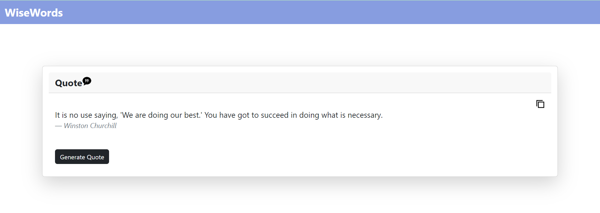

# Wise-Words

The Random Quote Generator App is a simple web application that displays random quotes. It fetches quotes from a free API and allows users to generate and copy quotes to their clipboard.

## Features

- Fetches random quotes from a free API.
- Displays a new random quote each time the user clicks the "Generate Quote" button.
- Provides a button to copy the displayed quote to the clipboard.
- Designed with a clean and user-friendly interface.

## Screenshots


## Getting Started

1. Clone the repository to your local machine:

   ```bash
   git clone https://github.com/aabhaaggarwal9/Wise-Words.git'''
2. Open the index.html file in your web browser.
3. Click the "Generate Quote" button to see a new random quote.
4. Click the copy icon to copy the quote to your clipboard.

## Technologies Used
* HTML
* CSS
* JavaScript
